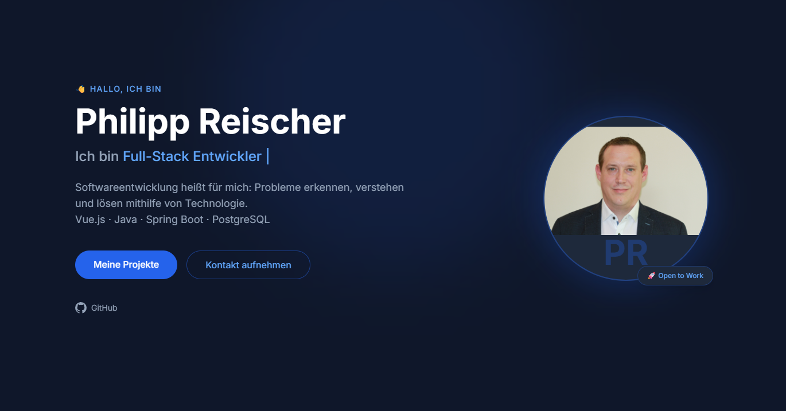
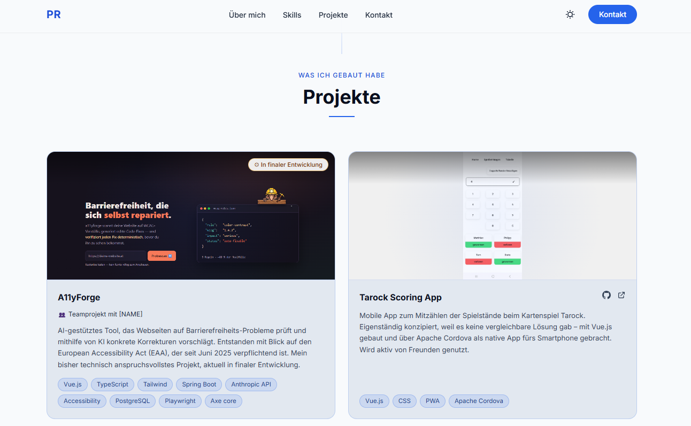
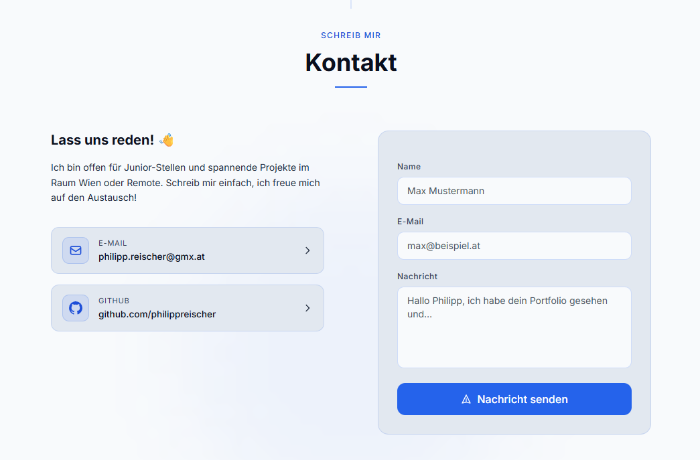

# Portfolio – Philipp Reischer

> Personal portfolio website — a career-changer's transition from technical sales to full-stack development, showcased through selected projects, skills, and background.



| Projects section | Contact section |
|---|---|
|  |  |

🔗 **Live Site:** https://philippreischer.github.io

> **Note:** The site content is written in German.

---

## Sections

- **Hero** — Animated intro with a personal dev-philosophy tagline, a self-cycling typewriter effect over role titles, a portrait avatar with an "Open to Work" badge, staggered fade-in of each element, CTA buttons, a GitHub link, and an animated scroll indicator.
- **Über mich (About)** — Personal career-changer narrative with quick-fact pills (location, education, availability, a personal note) and floating stat cards.
- **Skills** — Three categorized cards (Frontend, Backend, Tools) with technology tags, most rendered from self-hosted DevIcon SVGs. A "lernend" (learning) badge style is built in for in-progress skills, but is currently unused since all listed skills are active.
- **Projekte (Projects)** — Cards with a preview (screenshot or placeholder), an optional status badge (e.g. "In Arbeit" / "In finaler Entwicklung"), a description, tech-stack tags, and — where available — live/repo links.
- **Kontakt (Contact)** — A working contact form plus direct contact links (email, GitHub, LinkedIn).

## Features

- Dark/Light theme toggle with `localStorage` persistence and `prefers-color-scheme` system-preference detection (desktop and mobile toggles).
- Typewriter animation cycling through role descriptions (type/pause/delete loop) driven by vanilla JS.
- Scroll-triggered fade-in reveal animations via `IntersectionObserver`.
- Mobile-first responsive design with an animated hamburger menu and a navbar that gains a blur/shadow on scroll.
- Working contact form via Web3Forms — async submit, inline success message, and a shake animation on failure; no backend required.
- Self-hosted Inter font (GDPR-friendly, no external CDN calls).

## Tech Stack

- **Markup:** HTML5
- **Styling:** Tailwind CSS 3.4 (CLI-based, no framework) with class-based dark mode and named color tokens
- **JavaScript:** Vanilla JS (no framework)
- **Contact Form:** Web3Forms
- **Deployment:** GitHub Pages
- **Icons:** DevIcon SVGs (self-hosted) + inline SVG

## Design Approach

A minimal, technical aesthetic built around a "tech blue" accent (`#2563eb`, light variant `#60a5fa`) over slate neutrals — a near-black `#0f172a` background with an `#1e293b` surface in dark mode, and `#f8fafc` / `#e2e8f0` in light mode. Theming runs on Tailwind's class-based dark mode: a `.dark` class on the root element toggles the `dark:` variants and named color tokens, so both modes share one palette; the class is set before first paint to avoid a flash of the wrong theme. Typography uses the self-hosted Inter typeface (loaded via `@font-face`, no external CDN), and subtle touches — radial glows, translucent accent borders, and hover lift/shadow on cards — keep the surface clean while signaling a developer's attention to detail.

## Local Setup

```bash
git clone https://github.com/philippreischer/philippreischer.github.io.git
cd philippreischer.github.io
npm install
npm run watch   # rebuilds Tailwind CSS on changes
```

Then open `index.html` in your browser, or serve it with any static server:

```bash
npx serve .
```

### Build for production

```bash
npm run build
```

## Deployment

The site is deployed via GitHub Pages from the `main` branch. No build step is required for deployment since the compiled CSS is committed to the repository.

## Background

For the past five years I've worked in technical inside sales in the electrical industry — quotes, calculations, data management. The turning point was small: a colleague kept redoing the same calculation by hand, so I built him a spreadsheet tool to take it off his plate. What stuck wasn't the thanks — it was the question, *could I do this for a living?* I started teaching myself databases and programming in my spare time, and after the first small projects there was no turning back. For the past year I've been training part-time at CodersBay Vienna — Vue.js, Java, Spring Boot, databases, and increasingly AI-driven tools. For me, software development comes down to one thing: recognizing a problem, understanding it, and solving it with technology. I'm now looking for a junior full-stack role in and around Vienna (or remote), and this site is where I show what I've built so far.

## Status

Live and actively maintained as my primary online presence for job applications.

---

**Author:** Philipp Reischer  
**Contact:** [via the site's contact form](https://philippreischer.github.io#contact)
